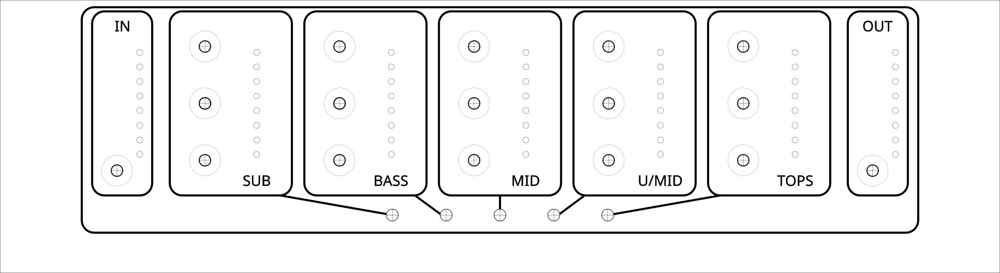
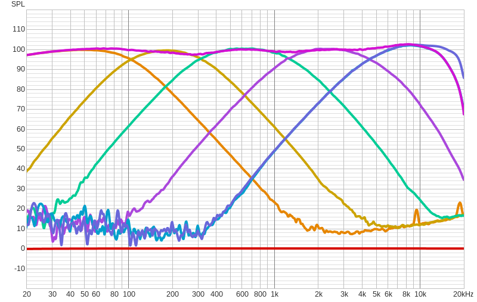
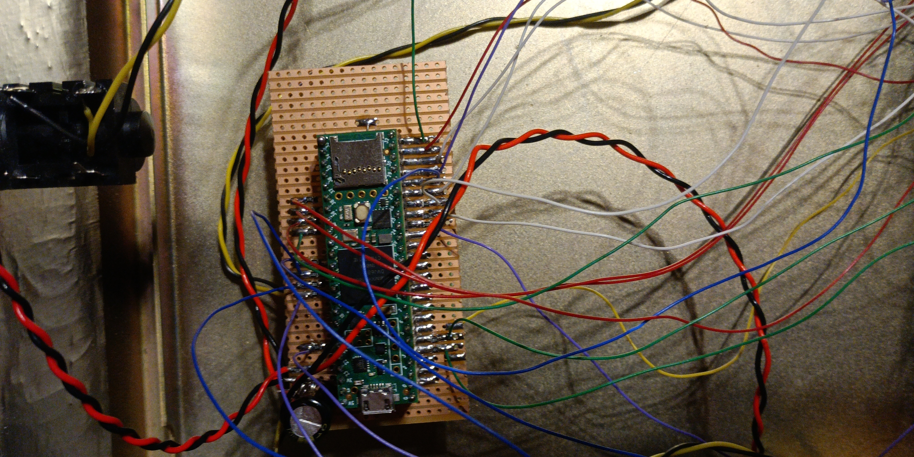
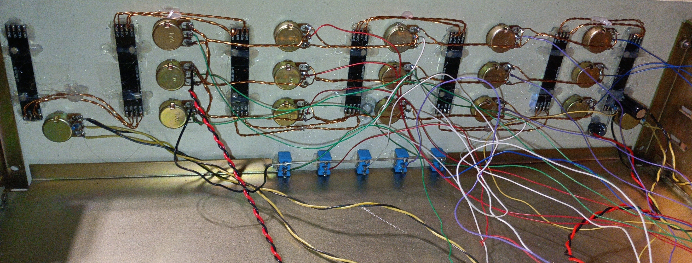
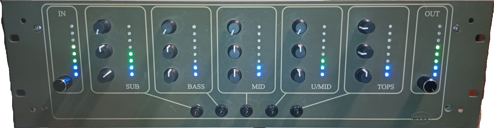

# eq5DubSculptor  
5-Band Dub Equalizer with Kill Switches

eq5DubSculptor is a 5-band dub-style equalizer designed for live sound system performance, inspired by classic dub consoles and kill-EQ techniques.

---

## Front Panel

---

## Features

- 5 frequency bands: SUB, BASS, MID, U/MID, TOPS
- Dedicated kill switch per band (instant mute)
- Mono audio input and output
- LED VU meters per band
- Pot control (gain, cutoff frequency, Q)
- Microcontroller-based Teensy 4.1 with official audio shield
- Designed for live dub performance

---

## Frequency Crossovers (log scale)

| Crossover          | Pot MIN | Pot MID (≈ 50%) | Pot MAX |
| ------------------ | ------- | --------------- | ------- |
| FC1 (SUB / BASS)   | 60 Hz   | **≈ 104 Hz**    | 180 Hz  |
| FC2 (BASS / MID)   | 180 Hz  | **≈ 329 Hz**    | 600 Hz  |
| FC3 (MID / U/MID)  | 600 Hz  | **≈ 1.22 kHz**  | 2.5 kHz |
| FC4 (U/MID / TOPS) | 2.5 kHz | **≈ 4.47 kHz**  | 8 kHz   |

---

## Prototype

